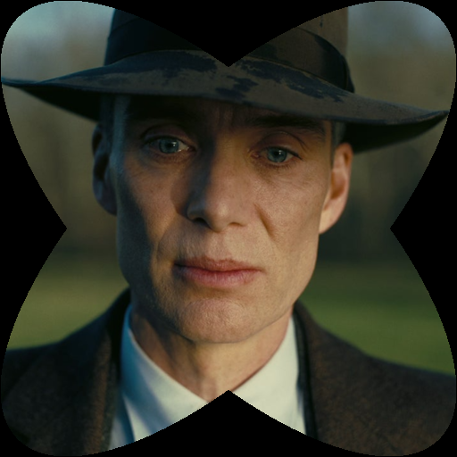
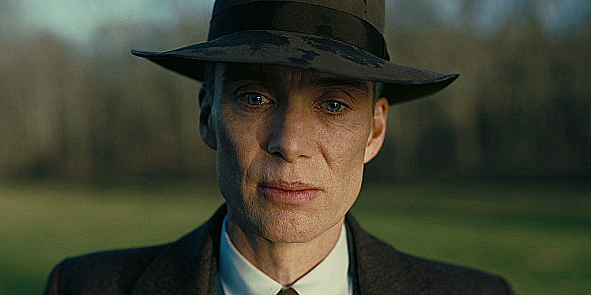

# Image Processing Project

This project involves basic image processing techniques using NumPy arrays. The following Python libraries are required:

## Required Libraries

| Library       | Description                                      |
|---------------|--------------------------------------------------|
| `Pillow`      | For reading and saving images (`from PIL import Image`) |
| `numpy`       | For manipulating image data as arrays            |
| `matplotlib`  | For displaying images using `pyplot`             |

## Installation

You can install all dependencies using the following command:

```bash
pip install -r requirements.txt
```
## Implementation Details

### Structure
The source code consists of separate functions for each image processing task and a main function `process_image` to call the corresponding function based on the user's selection.

| **No.** | **Function**                   | **Purpose**                                                |
|---------|--------------------------------|------------------------------------------------------------|
| 1       | `read_img()`                   | Reads an image and converts it to a NumPy array in RGB format. |
| 2       | `show_img()`                   | Displays the image using the matplotlib library.            |
| 3       | `save_img()`                   | Saves the image in the format of the original image.        |
| 4       | `increase_brightness()`        | Adjusts the brightness of the image.                       |
| 5       | `contrast()`                   | Adjusts the contrast of the image.                         |
| 6       | `flip_img()`                   | Flips the image horizontally or vertically.                |
| 7       | `grayscale()`                  | Creates a grayscale effect for the image.                   |
| 8       | `sepiascale()`                 | Creates a sepia tone effect for the image.                 |
| 9       | `blur_img()`                   | Blurs the image using convolution.                         |
| 10      | `sharpen_img()`                | Sharpens the image using convolution.                      |
| 11      | `crop_img_a_quarter()`         | Crops a quarter of the image from the center.              |
| 12      | `crop_img_circle()`            | Creates a circular frame with a black background.          |
| 13      | `find_formula_ellipses()`      | Generates the formula for two intersecting ellipses within a square or rectangle. |
| 14      | `crop_img_ellipse()`           | Creates a frame of two intersecting ellipses for the image. |
| 15      | `process_image()`              | Orchestrates the various functions.                        |
| 16      | `main()`                       | Calls `process_image()` and executes it.                   |

**Table: Preliminary structure of the functions**

## Experiment

### Square Image
<table>
  <tr>
    <td></td>
    <td></td>
    <td></td>
    <td></td>
  </tr>
  <tr>
    <td><i>Note: Blurred Oppenheimer Square</i></td>
    <td><i>Note: Brightened Oppenheimer Square</i></td>
    <td><i>Note: Contrasted Oppenheimer Square</i></td>
    <td><i>Note: Center-Cropped Oppenheimer Square</i></td>
  </tr>
  <tr>
    <td></td>
    <td></td>
    <td></td>
    <td></td>
  </tr>
  <tr>
    <td><i>Note: Circular-Cropped Oppenheimer Square</i></td>
    <td><i>Note: Elliptical-Cropped Oppenheimer Square</i></td>
    <td><i>Note: Horizontally Flipped Oppenheimer Square</i></td>
    <td><i>Note: Vertically Flipped Oppenheimer Square</i></td>
  </tr>
  <tr>
    <td></td>
    <td></td>
    <td></td>
    <td></td>
  </tr>
  <tr>
    <td><i>Note: Grayscale Oppenheimer Square</i></td>
    <td><i>Note: Sepia-Toned Oppenheimer Square</i></td>
    <td><i>Note: Sharpened Oppenheimer Square</i></td>
    <td></td>
  </tr>
</table>


### Rectangle Image
<table>
  <tr>
    <td></td>
    <td></td>
    <td></td>
    <td></td>
  </tr>
  <tr>
    <td><i>Note: Blurred Oppenheimer Rectangle</i></td>
    <td><i>Note: Brightened Oppenheimer Rectangle</i></td>
    <td><i>Note: Contrasted Oppenheimer Rectangle</i></td>
    <td><i>Note: Center-Cropped Oppenheimer Rectangle</i></td>
  </tr>
  <tr>
    <td></td>
    <td></td>
    <td></td>
    <td></td>
  </tr>
  <tr>
    <td><i>Note: Circular-Cropped Oppenheimer Rectangle</i></td>
    <td><i>Note: Elliptical-Cropped Oppenheimer Rectangle</i></td>
    <td><i>Note: Horizontally Flipped Oppenheimer Rectangle</i></td>
    <td><i>Note: Vertically Flipped Oppenheimer Rectangle</i></td>
  </tr>
  <tr>
    <td></td>
    <td></td>
    <td></td>
    <td></td>
  </tr>
  <tr>
    <td><i>Note: Grayscale Oppenheimer Rectangle</i></td>
    <td><i>Note: Sepia-Toned Oppenheimer Rectangle</i></td>
    <td><i>Note: Sharpened Oppenheimer Rectangle</i></td>
    <td></td>
  </tr>
</table>
