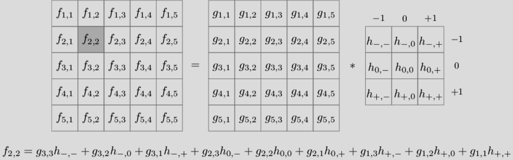
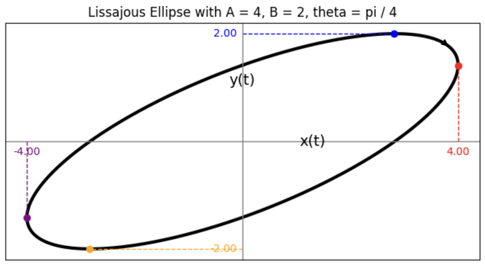
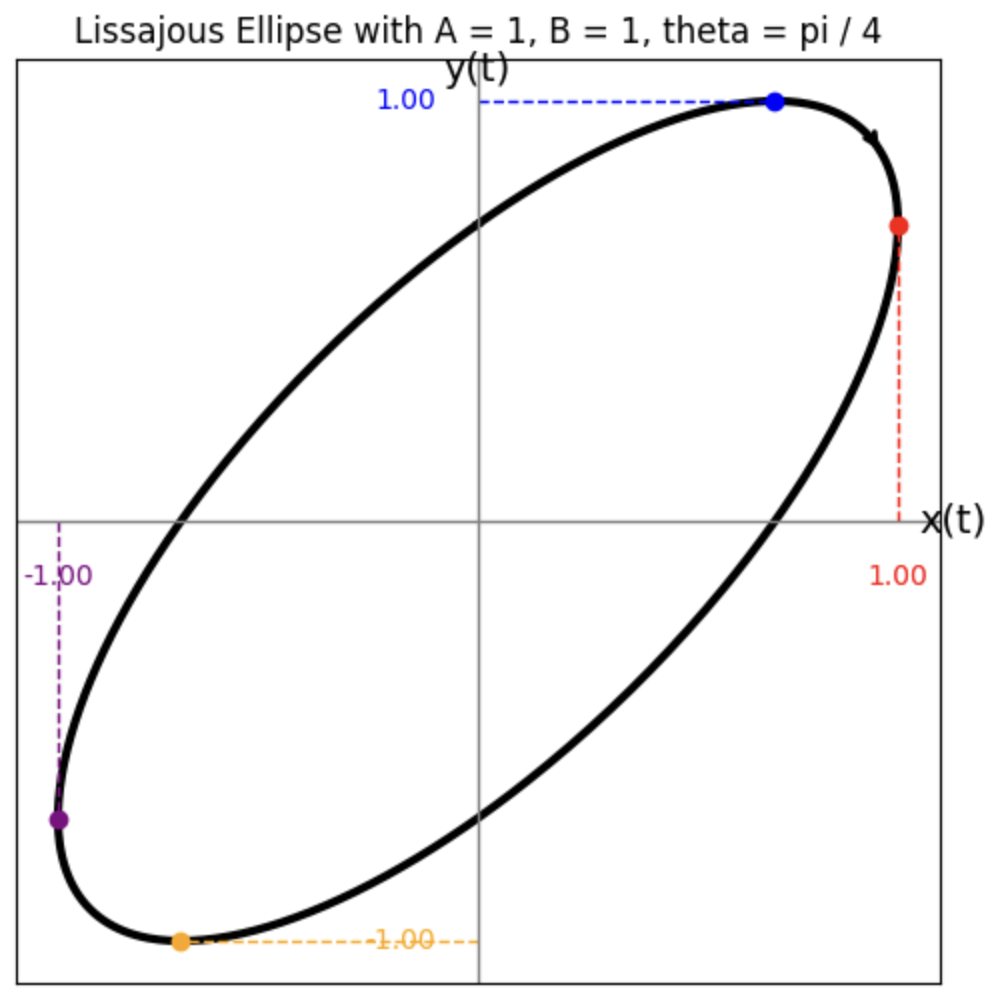
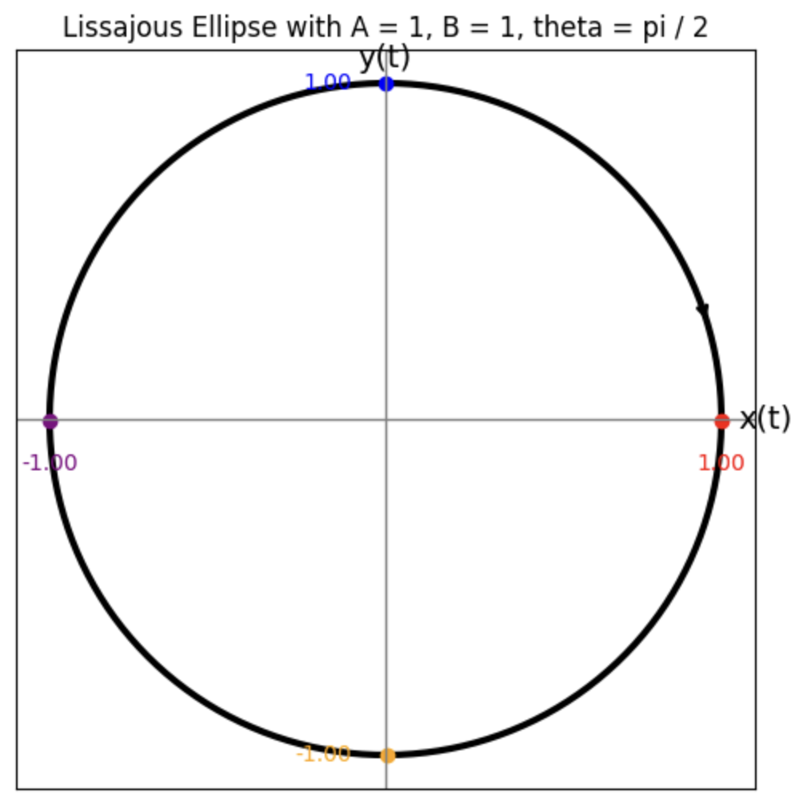
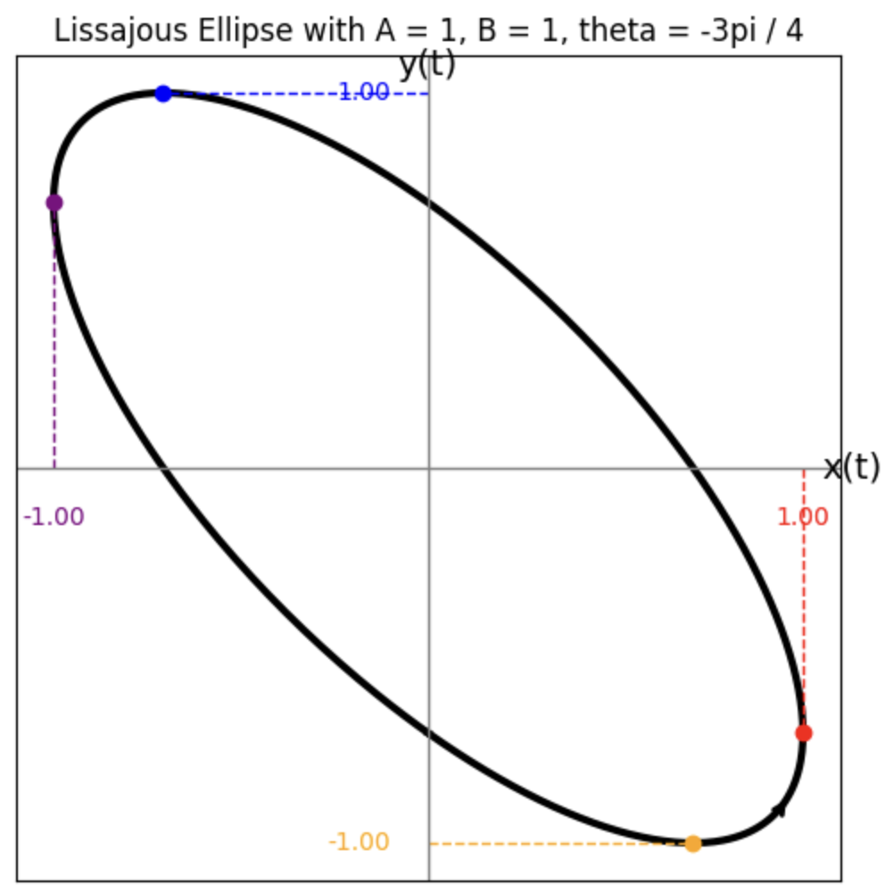
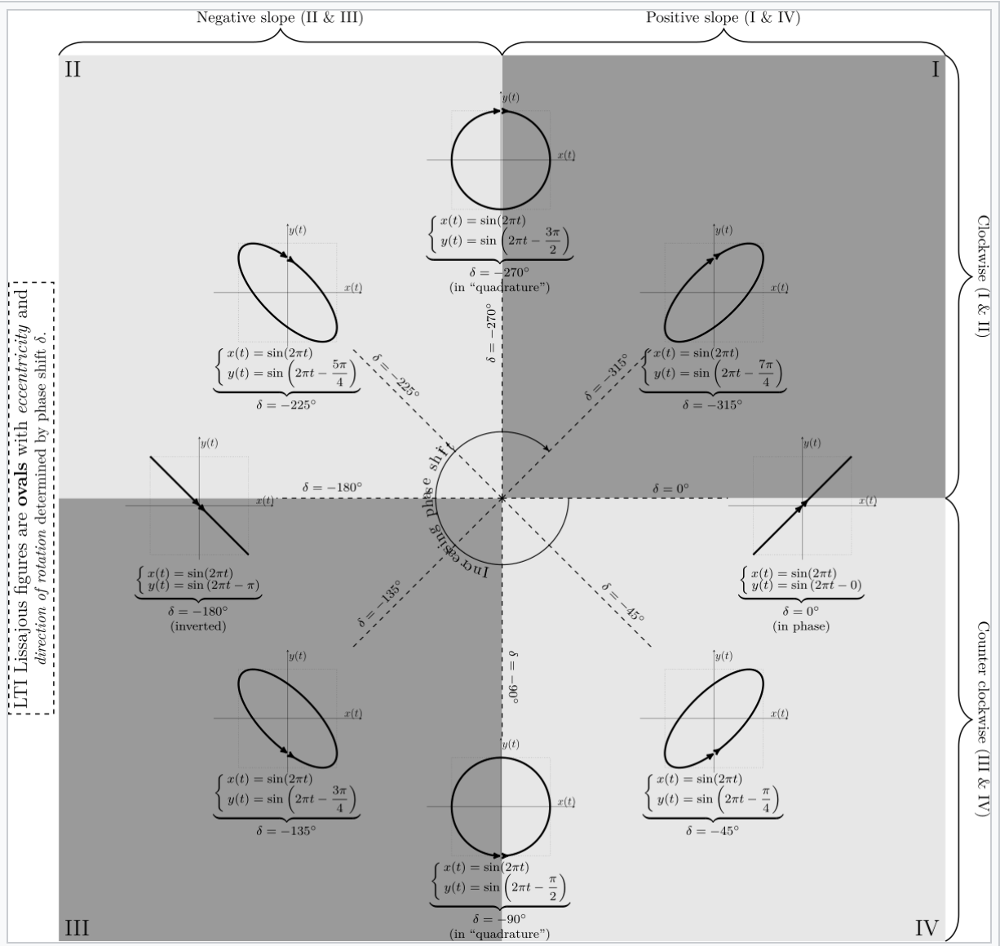

# 📦 Requirements for Image Processing Project

This project involves basic image processing techniques using NumPy arrays. The following Python libraries are required:

## 🧰 Required Libraries

| Library       | Description                                      |
|---------------|--------------------------------------------------|
| `Pillow`      | For reading and saving images (`from PIL import Image`) |
| `numpy`       | For manipulating image data as arrays            |
| `matplotlib`  | For displaying images using `pyplot`             |

## 📝 Installation

You can install all dependencies using the following command:

```bash
pip install -r requirements.txt


## Chi tiết thực hiện

### Cấu trúc
Mã nguồn bao gồm các hàm riêng biệt cho từng chức năng xử lý ảnh và một hàm chính `process_image` để gọi hàm tương ứng dựa trên lựa chọn của người dùng.

| **STT** | **Hàm**                        | **Chức năng**                                              |
|---------|--------------------------------|------------------------------------------------------------|
| 1       | `read_img()`                   | Đọc ảnh và chuyển thành mảng NumPy dạng RGB.               |
| 2       | `show_img()`                   | Hiển thị ảnh bằng thư viện matplotlib.                     |
| 3       | `save_img()`                   | Lưu ảnh dưới định dạng từ ảnh gốc.                         |
| 4       | `increase_brightness()`        | Tinh chỉnh độ sáng của hình ảnh.                           |
| 5       | `contrast()`                   | Tinh chỉnh độ tương phản của hình ảnh.                     |
| 6       | `flip_img()`                   | Lật ảnh ngang/dọc.                                         |
| 7       | `grayscale()`                  | Tạo hiệu ứng xám cho ảnh.                                  |
| 8       | `sepiascale()`                 | Tạo hiệu ứng màu sepia cho ảnh.                            |
| 9       | `blur_img()`                   | Làm mờ ảnh bằng Convolution.                               |
| 10      | `sharpen_img()`                | Làm sắc nét ảnh bằng Convolution.                          |
| 11      | `crop_img_a_quarter()`         | Cắt ảnh 1/4 từ trung tâm.                                  |
| 12      | `crop_img_circle()`            | Tạo khung hình tròn bên ngoài màu đen.                     |
| 13      | `find_formula_ellipses()`      | Tạo công thức 2 hình ellipse chéo nhau trong hình vuông hoặc chữ nhật. |
| 14      | `crop_img_ellipse()`           | Tạo khung 2 hình ellipse chéo nhau cho ảnh.                |
| 15      | `process_image()`              | Hàm điều phối các chức năng.                                |
| 16      | `main()`                       | Gọi hàm `process_image()` và thực hiện.                    |

**Bảng: Cấu trúc sơ bộ các hàm**

### Mô tả
Dưới đây là chi tiết từng hàm, bao gồm công thức, giải thích công thức và ưu điểm của từng chức năng.

#### Thay đổi độ sáng
**Hàm:** `increase_brightness()`

1. **Công thức**: \(\text{res} = \text{img} + \alpha\), sau đó clip giá trị về khoảng $[0, 255]$.
2. **Giải thích công thức**: Giá trị của mỗi màu trong pixel nằm trong khoảng $0$ đến $255$, biểu thị mức độ sáng – $0$ là đen hoàn toàn, $255$ là trắng hoàn toàn. Khi cộng thêm một số $\alpha$ vào tất cả các màu của pixel, giá trị màu pixel được đẩy lên cao hơn (hướng đến $255$ - màu trắng sáng), khiến toàn bộ ảnh trở nên sáng hơn. Phương pháp này đơn giản, trực quan, và tăng độ sáng đều trên toàn ảnh. Việc chuyển sang kiểu `np.int16` trước khi cộng đảm bảo không bị tràn số, và `np.clip` giữ giá trị pixel trong phạm vi hợp lệ ($0-255$).
3. **Ưu điểm**: Nhanh và dễ triển khai khi chỉ thực hiện 1 phép $+ \alpha$.

#### Thay đổi độ tương phản
**Hàm:** `contrast()`

1. **Công thức**: \(\text{res} = \text{mean} + \alpha \times (\text{img} - \text{mean})\).
   - \(\text{mean}:\) giá trị trung bình của ảnh theo từng kênh màu.
   - \(\text{img}:\) ảnh gốc chứa giá trị các điểm ảnh.
   - \(\text{img} - \text{mean}:\) độ lệch của các điểm ảnh so với mức trung bình.
   - $\alpha:$ Hệ số tăng cường độ tương phản, thường có giá trị $\geq 0$. Khi $\alpha > 1$ thì độ tương phản được tăng lên; khi $\alpha < 1$ thì độ tương phản giảm. Nếu $\alpha = 1$ thì ảnh giữ nguyên độ tương phản ban đầu.
2. **Giải thích công thức**:
   - Lấy giá trị điểm ảnh so sánh với giá trị trung bình (*mean*) để tìm độ lệch, tức là xác định điểm ảnh đó sáng hơn hay tối hơn mức trung bình bao nhiêu.
   - Nhân độ lệch này với $\alpha$ để phóng đại (tăng $\alpha > 1$) hoặc thu nhỏ ($\alpha < 1$) sự khác biệt này, tức tăng hoặc giảm khoảng cách tới *mean*.
   - Cuối cùng, cộng kết quả vừa tính với *mean* để thu được giá trị điểm ảnh mới (*res*), giúp các điểm ảnh phân bố xung quanh *mean*, từ đó đảm bảo tổng thể độ sáng trung bình của ảnh không thay đổi.
3. **Ưu điểm**: Công thức này giữ nguyên giá trị trung bình (*mean*) của ảnh, đảm bảo độ sáng tổng thể không thay đổi khi điều chỉnh độ tương phản. Nếu chỉ sử dụng công thức \(\text{res} = \alpha \times \text{img}\) sẽ làm cho ảnh có thể bị tăng/giảm độ sáng không theo ý muốn, dẫn đến làm giảm hiệu năng tăng giảm độ tương phản. Ví dụ ở [Figure: contrast_oppen](#fig-contrast-oppen) (**QUAN TRỌNG**) sẽ giúp thầy hiểu rõ sự khác biệt giữa 2 công thức.

#### Lật ảnh
**Hàm:** `flip_img()`

1. **Công thức**: Tận dụng hàm `np.flip()` có sẵn để hoán đổi các cột với nhau/các hàng với nhau.
2. **Ưu điểm**: Phương pháp này trực tiếp, dễ hiểu và nhanh khi hiểu các parameter của hàm `np.flip()` cần truyền. Điều này giúp số lượng dòng code ít hơn so với việc chạy vòng `for` 2 lần để hoán đổi từng pixel. Tốc độ nhanh hơn nhiều so với việc hoán đổi từng pixel khi duyệt vòng lặp lồng.

#### Tạo ảnh xám
**Hàm:** `grayscale()`

1. **Công thức**:
   - **Phương pháp 1**: Tính trung bình giá trị 3 màu R, G, B
     \[
     \text{gray}[i, j] = \frac{
         \overbrace{\text{img}[i, j, 0]}^{R} +
         \overbrace{\text{img}[i, j, 1]}^{G} +
         \overbrace{\text{img}[i, j, 2]}^{B}
     }{3}.
     \]
   - **Phương pháp 2**: Dùng công thức Luma: \(\text{Gray} = 0.299\text{R} + 0.587\text{G} + 0.114\text{B}\)
     \[
     \begin{bmatrix}
     \text{R}, \text{G}, \text{B}
     \end{bmatrix} \times
     \begin{bmatrix}
     0.299 \\
     0.587 \\
     0.114
     \end{bmatrix}
     \]
     Cả 2 cách đều dùng `np.float32` để tính toán chính xác, sau đó trả về kiểu `np.uint8`.
2. **Giải thích công thức**:
   - **Phương pháp 1**: Tính trung bình của 3 màu, mỗi màu đều góp tỷ lệ $\frac{1}{3} \approx 0.333$ cho việc tính tổng. Đây là điểm khác biệt lớn so với phương pháp 2 (tỷ lệ là khác nhau). Tổng của tất cả, ta có màu xám đại diện cho mức độ sáng của pixel khi sáng nhất - màu trắng ($=255$); tối nhất - màu đen ($= 0$).
   - **Phương pháp 2**: \(0.299\text{R} + 0.587\text{G} + 0.114\text{B}\)
     - Mỗi giá trị màu được nhân với trọng số tỉ lệ nhạy sáng mắt người:
       - Màu đỏ góp $\approx 29.9\%$
       - Màu xanh lá góp $\approx 58.7\%$
       - Màu xanh dương góp $\approx 11.4\%$
     - Tổng tất cả, ta được 1 kênh màu duy nhất là 1 màu xám. Vì **mắt người nhạy cảm nhất với màu xanh lá**, nên tỷ lệ cao giúp ảnh xám phản ánh độ sáng thật hơn, tự nhiên hơn, hợp với mắt người [](https://en.wikipedia.org/wiki/Grayscale#Converting_color_to_grayscale).
   - **Tổng kết**: Mặc dù thời gian chạy hàm của cả 2 phương pháp **không chênh lệch quá lớn**, nhưng vì phương pháp 2 được sử dụng rộng rãi trong grayscale và hợp mắt người hơn khi màu xanh lá chiếm tỷ lệ cao, em xin phép chọn sử dụng phương pháp 2 làm phương pháp chuyển đổi ảnh xám trong đồ án.
   - **Lưu ý**: Vì ảnh ban đầu có 3 kênh màu (R, G, B) nhưng sau khi chạy thuật toán kết quả chỉ còn 1 kênh màu (Gray), nên trong hàm `show_img()`, cần thêm tính năng kiểm tra số lượng kênh màu của tham số ảnh truyền vào. Từ đó, thêm `'cmap'='gray'` để hiển thị được màu xám theo mong muốn.
3. **Ưu điểm**: Sử dụng phương pháp nào cũng đơn giản và dễ triển khai, nhưng phương pháp 2 được ưa chuộng hơn vì độ sử dụng rộng rãi trong lịch sử và ý nghĩa sinh học khi mắt người nhạy cảm với màu *xanh lá* nhiều hơn.

#### Tạo ảnh sepia
**Hàm:** `sepiascale()`

1. **Công thức**: Nhân từng pixel với ma trận sepia:
   \[
   \begin{bmatrix}
   0.393 & 0.769 & 0.189 \\
   0.349 & 0.686 & 0.168 \\
   0.272 & 0.534 & 0.131
   \end{bmatrix} \times
   \begin{bmatrix}
   \text{R} \\
   \text{G} \\
   \text{B}
   \end{bmatrix}
   \]
2. **Giải thích công thức**: Hiệu ứng màu sepia có tông màu ấm, ngả vàng nâu, gợi nhớ phong cách ảnh cổ điển.
   - Tăng cường kênh đỏ (Red) với các trọng số cao nhất (so với các dòng khác của ma trận) ở đó (0.393, 0.769, 0.189) để tạo sắc đỏ vàng đặc trưng.
   - Đưa vào phần cân bằng màu vàng nâu bằng cách phối trộn vừa phải kênh xanh lá (Green) với các hệ số như 0.349 và 0.686.
   - Giảm bớt độ xanh dương (Blue) bằng các hệ số thấp hơn (0.272, 0.534, 0.131) làm ảnh trầm và ít xanh hơn.
   - **Ví dụ**:
     - Kênh màu ban đầu: $[R,G,B] = [67, 82, 87]$
     - Sau khi nhân: $[R,G,B] = [105.832, 94.251, 73.409004]$
     - Mặc dù ban đầu về tỉ lệ giá trị thì màu đỏ nhỏ nhất ($R=67$), sau đó là màu xanh lá ($G = 82$), lớn nhất là màu xanh dương ($B = 87$). Nhưng sau khi chuyển đổi sang màu sepia (sau khi nhân ma trận), tỷ lệ màu đã thay đổi với sự vượt trội giá trị của màu đỏ, sau đó tới màu xanh lá và nhỏ nhất hiện tại là màu xanh dương ($R=105.832, G = 94.251, B=73.409004$).
3. **Ưu điểm**: Đảm bảo kết quả nhất quán và đúng với hiệu ứng sepia truyền thống.

#### Làm mờ ảnh
**Hàm:** `blur_img()`

1. **Công thức**: Sử dụng kernel box blur:
   \[
   \frac{1}{9} \times 
   \begin{bmatrix}
   1 & 1 & 1 \\ 
   1 & 1 & 1 \\ 
   1 & 1 & 1
   \end{bmatrix}
   \]
   Và sử dụng công thức Matrix Convolution [](https://vincmazet.github.io/bip/filtering/convolution.html):
   \[
   f(x, y) = (g*h)(x,y) = \sum_{m}\sum_{n}g\left(x-m, \ y-n\right)h(m,n)
   \]
   để nhân từng **vùng ảnh** từ ảnh gốc với kernel box blur.
2. **Giải thích công thức**: Để hiểu rõ kỹ thuật làm mờ ảnh, cần giải thích rõ về việc công thức Convolution hoạt động [](https://vincmazet.github.io/bip/filtering/convolution.html).
   
   **Hình: Ví dụ tính toán pixel (2,2) của f**  
   *Xác định vùng lân cận*: Pixel \((2,2)\) trong \( f \) tương ứng với vùng 3x3 trong \( g \) từ hàng 1 đến 3 và cột 1 đến 3:
   \[
   \begin{bmatrix}
   g_{1,1} & g_{1,2} & g_{1,3} \\
   g_{2,1} & g_{2,2} & g_{2,3} \\
   g_{3,1} & g_{3,2} & g_{3,3}
   \end{bmatrix}
   \text{;} \quad \text{kernel } h =
   \begin{bmatrix}
   h_{-, -} & h_{-, 0} & h_{-, +} \\
   h_{0, -} & h_{0, 0} & h_{0, +} \\
   h_{+, -} & h_{+, 0} & h_{+, +}
   \end{bmatrix}
   \]
   Mỗi phần tử trong vùng lân cận của \( g \) được nhân với phần tử tương ứng trong \( h \), sau đó tổng hợp lại theo công thức \((g*h)(x,y) = \sum_{m}\sum_{n}g\left(x-m, \ y-n\right)h(m,n)\).

   Việc lấy các cặp phần tử từ \(g\) và \(h\) giống như việc lật (flip) ma trận \(h\) theo chiều dọc, sau đó lật (flip) theo chiều ngang rồi lấy cặp theo từng vị trí \((i,j)\). Sau đó tính tổng lại, ta được \(f_{2,2}\).

   Pixel \((2,2)\) của \( f \) đại diện cho kết quả tích chập tại vị trí trung tâm của vùng 3x3 trong ảnh gốc \( g \), phản ánh ảnh hưởng của các pixel lân cận theo trọng số được định nghĩa bởi kernel \( h \).

   **Kernel sử dụng**: Việc sử dụng kernel box blur nêu trên:
   \[
   \frac{1}{9} \times 
   \begin{bmatrix}
   1 & 1 & 1 \\ 
   1 & 1 & 1 \\ 
   1 & 1 & 1
   \end{bmatrix}
   \]
   cũng thể hiện rõ ý nghĩa thuật toán - tại mỗi pixel, gán giá trị mới là **trung bình giá trị của các pixel xung quanh** (tính **tổng** và sử dụng **phép chia** cho $9$ - số lượng pixel trong **vùng ảnh** được xét).

   **Padding cho ảnh**: Vì ở pixel thuộc các dòng đầu/cuối và cột đầu/cuối, chúng ta không có đủ pixel xung quanh để tạo thành **vùng ảnh** cho việc nhân ma trận kernel. Do đó, cần padding thêm các cột/dòng cho ảnh. Ở việc làm mờ, tận dụng hàm `np.pad()` của numpy, em chỉnh `mode='constant'`. Trong trường hợp này, các pixel mới được thêm vào biên được đặt thành $0$ (giá trị default của `mode='constant'`). Để lý giải cho việc này:
   - **Tính chất làm mờ**: Mục tiêu của việc làm mờ là giảm nhiễu và làm mịn ảnh bằng cách lấy trung bình hoặc trọng số của các pixel lân cận. Khi padding bằng $0$, các pixel ở biên sẽ bị ảnh hưởng bởi giá trị $0$ này, **không làm nổi bật lên tính chất của các cạnh padding**.
   - **Tốc độ tính toán**: Sử dụng giá trị $0$ cũng giúp tính toán nhanh hơn.
3. **Ưu điểm**: Đơn giản và dễ hiểu với kernel default (chỉ lấy trung bình các cạnh xung quanh), tạo hiệu ứng làm mờ bằng cách lấy trung bình các pixel lân cận. Nhanh và phù hợp cho các ứng dụng cơ bản, nhưng hiệu ứng làm mờ vẫn chưa đủ mạnh.

#### Làm nét ảnh
**Hàm:** `sharpen_img()`

1. **Công thức**: Có 2 loại kernel làm nét em muốn đề cập đến. Sau khi giải thích, em sẽ lựa chọn 1 trong 2 làm kernel default cho hàm.

   **Kernel loại 1** [](https://en.wikipedia.org/wiki/Kernel_(image_processing)):
   \[
   \begin{bmatrix}
   0 & -1 & 0 \\
   -1 & 5 & -1 \\
   0 & -1 & 0
   \end{bmatrix}
   \]

   **Kernel loại 2** [](https://web.pdx.edu/~jduh/courses/Archive/geog481w07/Students/Ludwig_ImageConvolution.pdf):
   \[
   \begin{bmatrix}
   -1 & -1 & -1 \\
   -1 & 9 & -1 \\
   -1 & -1 & -1
   \end{bmatrix}
   \]

2. **Giải thích công thức**: Về cách Convolution hoạt động cũng như ở **làm mờ ảnh** nên em sẽ không tiếp tục đề cập đến ở phần này.

   **Kernel sử dụng**: Sau quá trình thực nghiệm và so sánh (ở [Figure: sharpen_oppen](#fig-sharpen-oppen)). Kernel loại 2 cho hình ảnh sắc nét hơn (thường là nhu cầu chủ yếu để nhìn rõ hình dạng của các ảnh mờ). Nên em quyết định sử dụng kernel loại 2 để làm default kernel cho hàm `sharpen_img()`. Để giải thích cho việc kernel loại 2 hoạt động tốt hơn:
   - Giá trị trung tâm của kernel được tăng lên ($5 < 9$). Khi này, cứ mỗi pixel được xét đến, màu của nó chiếm tỷ trọng cao trong phép tính TỔNG.
   - Giá trị xung quanh có thêm giá trị $-1$ thay cho $0$. Điều này càng làm giảm độ ảnh hưởng của các giá trị điểm màu pixel xung quanh trong phép tính TỔNG.

   **Padding cho ảnh**: Tương tự ở **làm mờ ảnh**, cần phải padding cho ảnh. Ở việc làm sắc nét, tận dụng hàm `np.pad()` của numpy, em chỉnh `mode='edge'`. Trong trường hợp này, `mode='edge'` lấp đầy vùng padding bằng cách lặp lại giá trị của pixel biên gần nhất. Để lý giải:
   - **Bảo toàn thông tin biên**: Mục tiêu của phép làm sắc nét là tăng cường các cạnh và chi tiết trong ảnh bằng cách tăng độ tương phản. Nếu sử dụng padding `constant` với giá trị $0$, các pixel biên có **xu hướng kéo về** $0$, có thể làm mất đi thông tin biên tự nhiên. Mode `edge` giúp hình ảnh giữ nguyên giá trị biên, **đảm bảo rằng các cạnh thực sự trong ảnh được tăng cường một cách chính xác**.
3. **Ưu điểm**: Kernel này **tăng cường giá trị pixel trung tâm** (giá trị $9$) và **giảm giá trị** các pixel **xung quanh** (các giá trị $-1$) tạo hiệu ứng làm nét. Phương pháp này đơn giản và hiệu quả cho các trường hợp cơ bản, hoạt động tốt cho việc làm sắc nét rõ vật thể (xem tại [Figure: sharpen_oppen](#fig-sharpen-oppen)).

#### Cắt ảnh 1/4 tính từ trung tâm
**Hàm:** `crop_img_a_quarter()`

1. **Công thức**:
   Cho ảnh đầu vào có chiều cao $m$ và chiều rộng $n$. Kích thước vùng cắt được xác định bởi:
   \[
   \text{input_size} = \left( \left\lfloor \frac{m}{2} \right\rfloor, \left\lfloor \frac{n}{2} \right\rfloor \right)
   \]
   Tâm ảnh được tính:
   \[
   \text{center} = \left( \frac{m - 1}{2}, \frac{n - 1}{2} \right)
   \]

   Điểm bắt đầu cắt (tọa độ góc trên bên trái của vùng cắt) là:
   \[
   \text{idx} = \left( \text{center}_x - \frac{\text{input_size}_0}{2}, \quad \text{center}_y - \frac{\text{input_size}_1}{2} \right)
   \]

   Kết quả là \(\text{cropped - ma trận con của } \text{img}, \text{ lấy từ dòng } i_0 \text{ đến } i_0 + s_0,\ 
   \text{và từ cột } i_1 \text{ đến } i_1 + s_1.\)
   \[
   \text{Trong đó:} \quad i_0 = \text{idx}_0,\quad s_0 = \text{input_size}_0,\quad
   i_1 = \text{idx}_1,\quad s_1 = \text{input_size}_1
   \]
2. **Giải thích công thức**:
   - Hàm lấy một vùng hình chữ nhật / hình vuông (tuỳ vào kích thước ảnh gốc) ở vị trí giữa ảnh gốc, với chiều cao và chiều rộng bằng một nửa chiều cao và chiều rộng ảnh gốc.
   - Tâm ảnh được xác định để biết trung điểm ảnh sao cho vùng cắt được căn giữa chuẩn xác.
   - Điểm bắt đầu cắt được tính bằng cách trừ đi nửa kích thước vùng cắt khỏi tâm.
   - Cuối cùng, slicing (cắt mảng) được sử dụng để lấy vùng ảnh theo tọa độ tính được.
   - **Note**: Kích thước vùng cắt bằng một phần tư diện tích ảnh gốc (bởi vì \(\frac{1}{2} \times \frac{1}{2} = \frac{1}{4}\)), giúp giảm kích thước ảnh nhưng vẫn giữ lại vùng trung tâm quan trọng.
3. **Ưu điểm**: Chỉ cần tìm điểm pixel góc trên trái của vùng crop (nhờ tâm ảnh) và tận dụng khả năng slicing của Python. Phương pháp này đơn giản, trực quan, dễ hiểu, và dễ dàng thực hiện bằng numpy slicing hiệu quả. Giữ được phần trung tâm và có thể dễ dàng mở rộng để thay đổi tỉ lệ crop bằng cách sử dụng tham số `alpha` (`default alpha=0.25`) để điều chỉnh kích thước vùng cắt.

#### Cắt ảnh theo khung hình tròn
**Hàm:** `crop_img_circle()`

1. **Công thức**: Giữ lại màu các điểm pixel \((x,y)\) thoả:
   \[
   f(x, y) := (x - \text{center}_x)^2 + (y - \text{center}_y)^2 \leq r^2
   \]
   Với tâm và bán kính được tính như sau:
   \[
   \begin{cases}
   \text{center} = (\text{center}_x \ , \ \text{center}_y) = \left(\frac{\text{width}-1}{2}, \frac{\text{height}-1}{2}\right) \\[3pt]
   r = \frac{\min\left(\text{width}, \ \text{height}\right)}{2}
   \end{cases}
   \]
   Còn lại, gán giá trị $0$ cho từng màu của các pixel ngoài vùng.
2. **Ưu điểm**: Dùng tính chất cơ bản của hình học khi biết tâm và bán kính để xác định hình tròn cần. Từ đó, xác định được vùng cần giữ lại màu là trọng tâm của khung ảnh.

#### Cắt ảnh theo khung 2 hình elip chéo nhau
**Hàm:** `crop_img_ellipse()`

1. **Công thức**: Cho trước \(\theta\), chỉ giữ lại các điểm ảnh có toạ độ \((x,y)\) thoả:
   \[
   \begin{cases}
   \sin^2 \theta \geq \frac{x^2}{A^2} + \frac{y^2}{B^2} + \frac{2xy}{AB} \cos \theta \\[6pt]
   \sin^2 \theta \geq \frac{x^2}{A^2} + \frac{y^2}{B^2} - \frac{2xy}{AB} \cos \theta
   \end{cases}
   , \quad \quad \frac{\pi}{2} \leq \theta < \pi
   \]
   Còn lại, gán giá trị $0$ cho từng màu của các pixel ngoài vùng.
2. **Giải thích công thức**:

   **Công thức Lissajous Ellipse**

   Dựa trên nguồn [Wikipedia-Lissajous Curve](https://en.wikipedia.org/wiki/Lissajous_curve), ta có công thức:
   \[
   \begin{cases}
   x = A\sin(at) \\
   y = B\sin(at + \theta)
   \end{cases}
   \]

   Dựa vào chú thích trong [Wikipedia-Lissajous Curve](https://en.wikipedia.org/wiki/Lissajous_curve), để tạo hình ellipse, ta cần tần số \(a=b\), nên đặt \(a=b = 2\pi\). Cuối cùng ta được công thức Lissajous Ellipse tổng quát theo \(x,y\):
   \[
   \begin{cases}
   x = A\sin(2 \pi t) \\[3pt]
   y = B\sin(2\pi t + \theta)
   \end{cases}
   \]

   **Biến đổi công thức Lissajous Ellipse thành phương trình biểu diễn theo \(\theta, A, B\)**

   Ta có công thức lượng giác:
   \[
   \sin X + \sin Y = 2 \sin\left( \frac{X + Y}{2} \right) \cos\left( \frac{X - Y}{2} \right)
   \]

   Với \( X = 2\pi t \) và \( Y = 2\pi t + \theta \), thay vào ta được:
   \[
   \frac{x}{A} + \frac{y}{B} = 2 \sin\left( \frac{2\pi t + (2\pi t + \theta)}{2} \right) \cos\left( \frac{2\pi t - (2\pi t + \theta)}{2} \right)
   \]
   \[
   = 2 \sin\left( \frac{4\pi t + \theta}{2} \right) \cos\left( \frac{-\theta}{2} \right)
   \]
   \[
   = 2 \sin\left( 2\pi t + \frac{\theta}{2} \right) \cos\left( \frac{\theta}{2} \right)
   \]

   Với \(\theta \ne \pi\), suy ra:
   \[
   \sin\left( 2\pi t + \frac{\theta}{2} \right) = \frac{\frac{x}{A} + \frac{y}{B}}{2 \cos\left( \frac{\theta}{2} \right)}
   \]

   Tương tự, ta có công thức:
   \[
   \sin X - \sin Y = 2 \cos\left( \frac{X + Y}{2} \right) \sin\left( \frac{X - Y}{2} \right)
   \]

   Với \( X = 2\pi t \) và \( Y = 2\pi t + \theta \), thay vào ta được:
   \[
   \frac{x}{A} - \frac{y}{B} = 2 \cos\left( \frac{2\pi t + (2\pi t + \theta)}{2} \right) \sin\left( \frac{2\pi t - (2\pi t + \theta)}{2} \right)
   \]
   \[
   = 2 \cos\left( 2\pi t + \frac{\theta}{2} \right) \sin\left( -\frac{\theta}{2} \right)
   \]
   \[
   = -2 \cos\left( 2\pi t + \frac{\theta}{2} \right) \sin\left( \frac{\theta}{2} \right)
   \]

   Với \(\theta \ne 0\), suy ra:
   \[
   \cos\left( 2\pi t + \frac{\theta}{2} \right) = -\frac{\frac{x}{A} - \frac{y}{B}}{2 \sin\left( \frac{\theta}{2} \right)}
   \]

   Từ hai phương trình trên, với \(\theta \ne 0,\pi\), áp dụng đẳng thức lượng giác \(\cos^2 \alpha + \sin^2 \alpha = 1\), ta có:
   \[
   \cos^2\left( 2\pi t + \frac{\theta}{2} \right) + \sin^2\left( 2\pi t + \frac{\theta}{2} \right) = \left( \frac{\frac{x}{A} - \frac{y}{B}}{-2 \sin\left( \frac{\theta}{2} \right)} \right)^2 + \left( \frac{\frac{x}{A} + \frac{y}{B}}{2 \cos\left( \frac{\theta}{2} \right)} \right)^2
   \]

   \[
   \Leftrightarrow \quad 1 = \frac{\left(\frac{x}{A} - \frac{y}{B}\right)^2}{4 \sin^2\left( \frac{\theta}{2} \right)} + \frac{\left(\frac{x}{A} + \frac{y}{B}\right)^2}{4 \cos^2\left( \frac{\theta}{2} \right)}
   \]

   Đặt chung mẫu số:
   \[
   1 = \frac{\left(\frac{x}{A} - \frac{y}{B}\right)^2 \cos^2\left( \frac{\theta}{2} \right) + \left(\frac{x}{A} + \frac{y}{B}\right)^2 \sin^2\left( \frac{\theta}{2} \right)}{4 \cos^2\left( \frac{\theta}{2} \right) \sin^2\left( \frac{\theta}{2} \right)}
   \]

   Nhân cả hai vế với \( 4 \cos^2\left( \frac{\theta}{2} \right) \sin^2\left( \frac{\theta}{2} \right) \):
   \[
   4 \cos^2\left( \frac{\theta}{2} \right) \sin^2\left( \frac{\theta}{2} \right) = \left(\frac{x}{A} - \frac{y}{B}\right)^2 \cos^2\left( \frac{\theta}{2} \right) + \left(\frac{x}{A} + \frac{y}{B}\right)^2 \sin^2\left( \frac{\theta}{2} \right)
   \]

   Vì \( 4 \cos^2\left( \frac{\theta}{2} \right) \sin^2\left( \frac{\theta}{2} \right) = \sin^2 \theta \), ta được:
   \[
   \sin^2 \theta = \left(\left(\frac{x}{A}\right)^2 - \frac{2xy}{AB} + \left(\frac{y}{B}\right)^2\right) \cos^2\left( \frac{\theta}{2} \right) + \left(\left(\frac{x}{A}\right)^2 + \frac{2xy}{AB} + \left(\frac{y}{B}\right)^2\right) \sin^2\left( \frac{\theta}{2} \right)
   \]
   \[
   = \left[ \cos^2\left( \frac{\theta}{2} \right) + \sin^2\left( \frac{\theta}{2} \right) \right] \left(\frac{x^2}{A^2} + \frac{y^2}{B^2}\right) - \frac{2xy}{AB} \left[ \cos^2\left( \frac{\theta}{2} \right) - \sin^2\left( \frac{\theta}{2} \right) \right]
   \]
   \[
   = \frac{x^2}{A^2} + \frac{y^2}{B^2} - \frac{2xy}{AB} \cos \theta
   \]

   Vậy, phương trình Lissajous Ellipse biểu diễn theo \(\theta, A, B\):
   \[
   \sin^2 \theta = \frac{x^2}{A^2} + \frac{y^2}{B^2} - \frac{2xy}{AB} \cos \theta
   \]

   **Minh hoạ hình ảnh đồ thị từ công thức Lissajous Ellipse theo \(\theta, A, B\)**

   Ta sẽ thử vẽ 1 hình Lissajous Ellipse theo biểu thức trên với \(A = 4, B=2, \theta = \frac{\pi}{4}\):

   
   **Hình: Lissajous Ellipse với \(A = 4, B=2, \theta = \frac{\pi}{4}\)**

   Khi này với \(A= 4\), giá trị lớn nhất mà \(x\) có thể đạt được là \(x=4\). Tương tự, với \(B= 2\), giá trị lớn nhất mà \(y\) có thể đạt được là \(y=2\). Do đó, vì giá trị của 2 hàm \(\sin, \cos\) đều thuộc \([-1, 1]\) nên với giá trị \(A=4, B=2\), Lissajous Ellipse sẽ bị ảnh hưởng, tức hình Ellipse đang nội tiếp hình chữ nhật có chiều dài và rộng lần lượt là \(a = 4, b = 2\). Vậy để Lissajous Ellipse nội tiếp hình vuông (cạnh đều bằng nhau) thì ta cần \(A = B\), và với ảnh \(512 \times 512\) thì cần \(A= B = 512\). Nhưng để đơn giản hoá, ta chuẩn hoá \(A= B = 1\):

   
   **Hình: \(A = 1, B=1, \theta = \frac{\pi}{8}\)**

   
   **Hình: \(A = 1, B=1, \theta = \frac{\pi}{4}\)**

   
   **Hình: \(A = 1, B=1, \theta = \frac{\pi}{2}\)**

   **Hình: Lissajous ellipse nội tiếp hình vuông \(2\times2\) với \(\theta\) biến thiên**

   Ta có thể thấy hiện tại hình Ellipse đã nội tiếp hình vuông có cạnh \(a = 1\). Nhưng khi này với \(\theta\) thay đổi từ \(\frac{\pi}{8} \rightarrow \frac{\pi}{4} \rightarrow \frac{\pi}{2}\), hình dạng Lissajous Ellipse cũng đã thay đổi:
   - Với \(\frac{\pi}{8}\), Ellipse hẹp hơn, tức chỉ số eccentricity \(e= \sqrt{1-\frac{b^2}{a^2}}\) của hình Ellipse còn nhỏ [](https://en.wikipedia.org/wiki/Ellipse).
   - Với \(\frac{\pi}{4}\), Ellipse trở nên tròn hơn, tức \(e\) cao hơn so với \(\frac{\pi}{8}\).
   - Với \(\frac{\pi}{2}\), Ellipse trở thành hình tròn, tức tiêu cự \(c = 0\) dẫn tới \(e = 0 \rightarrow b=a\).

   Mặt khác, khi thay đổi \(\theta = -\frac{3\pi}{4}\):

   
   **Hình: Lissajous Ellipse với \(A = 1, B=1, \theta = \frac{-3\pi}{4}\)**

   Chiều đã thay đổi, như vậy chúng ta chỉ cần thay đổi giá trị \(\theta\) trong 1 khoảng hợp lý (ánh xạ về miền giá trị từ \([0,1]\)) với 2 bất phương trình Lissajous Ellipse:
   \[
   \begin{cases}
   \sin^2 \theta \geq \frac{x^2}{A^2} + \frac{y^2}{B^2} + \frac{2xy}{AB} \cos \theta \\[6pt]
   \sin^2 \theta \geq \frac{x^2}{A^2} + \frac{y^2}{B^2} - \frac{2xy}{AB} \cos \theta
   \end{cases}
   ,\quad \quad \frac{\pi}{2} \leq \theta < \pi
   \]
   sẽ có thể lấy được khung các điểm ảnh chỉ nằm trong 2 hình Ellipse chéo nhau nội tiếp hình vuông cạnh \(a= A= B\) thoả yêu cầu (các điểm ảnh nằm ngoài sẽ được gán giá trị \(0\) cho từng màu).

   **Chú thích**: Vì giá trị \(\theta\) thay đổi từ \[](https://en.wikipedia.org/wiki/Lissajous_curve). Nên ta chỉ cần xét 1 miền xác định cho \(\theta\), ở đây là \([\frac{\pi}{2}, \pi]\).

   
   **Hình: \(a = b = 2\pi\) và sự thay đổi \(\theta\) ảnh hưởng hình dạng Lissajous Ellipse**

   **Ánh xạ \(\theta\) từ miền xác định \([0, 1]\) về \([\frac{\pi}{2}, \pi]\)**

   Với \(f: [0, 1] \rightarrow [\frac{\pi}{2}, \pi]\), sử dụng công thức:
   \[
   \theta = f(\alpha) = \alpha \times \frac{\pi}{2}+ \frac{\pi}{2} \ \ , \  \forall\alpha \in [0, 1]
   \]

3. **Ưu điểm**: Cho phép vẽ hình Ellipse ảnh theo các hình dạng khác nhau, từ hẹp tới tròn chỉ bằng việc thay đổi \(\theta\) khi đã biết \(A, B\) dựa trên độ dài hình ảnh (bất kể hình vuông hay hình chữ nhật).

#### Hàm thể hiện các chức năng
**Hàm:** `process_image()`

- `0`: Thực hiện tất cả các xử lý: sáng, tương phản, lật, xám, sepia, mờ, nét, crop giữa, crop tròn/ellipse
- `1`: Tăng/giảm độ sáng
- `2`: Tăng/giảm độ tương phản
- `3`: Lật ảnh dọc và ngang
- `4`: Chuyển ảnh sang xám và sepia
- `5`: Làm mờ và làm nét ảnh
- `6`: Cắt vùng trung tâm của ảnh
- `7`: Cắt ảnh theo hình tròn và hình ellipse