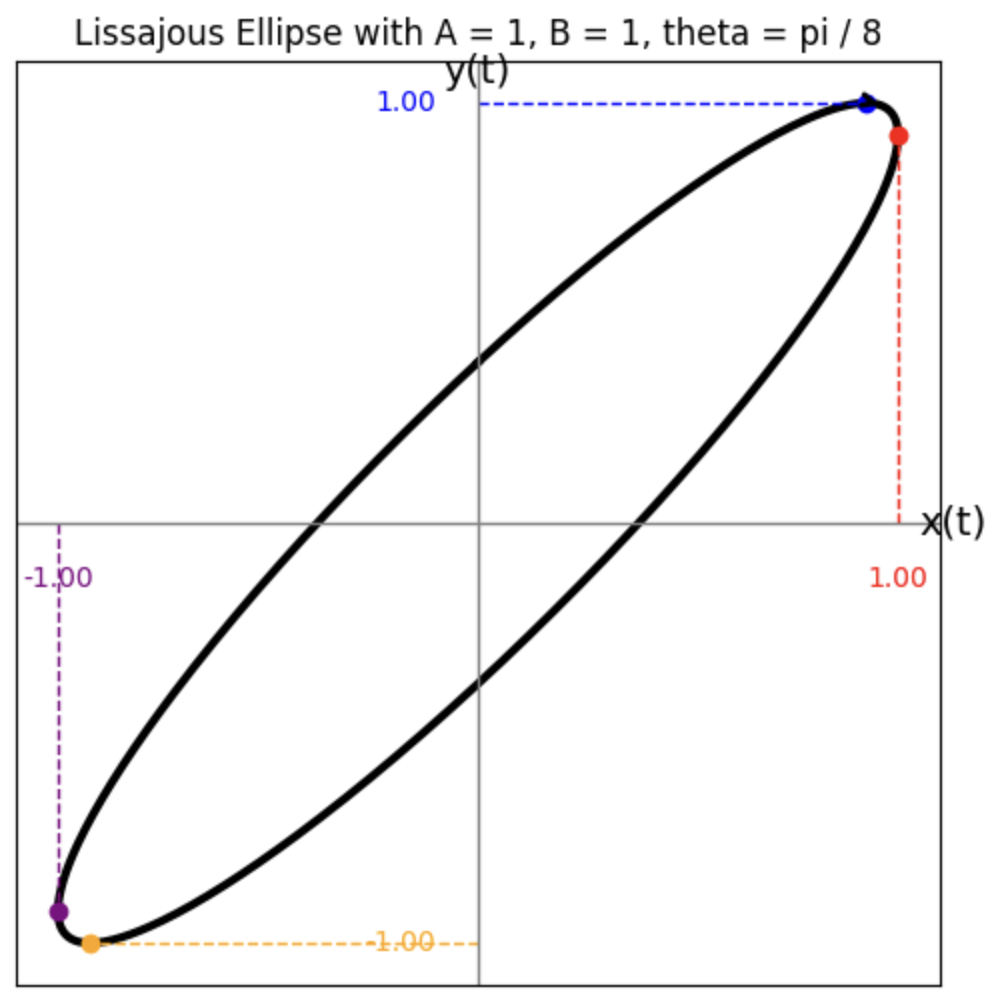

# 📦 Requirements for Image Processing Project

This project involves basic image processing techniques using NumPy arrays. The following Python libraries are required:

## 🧰 Required Libraries

| Library       | Description                                      |
|---------------|--------------------------------------------------|
| `Pillow`      | For reading and saving images (`from PIL import Image`) |
| `numpy`       | For manipulating image data as arrays            |
| `matplotlib`  | For displaying images using `pyplot`             |

## 📝 Installation

You can install all dependencies using the following command:

```bash
pip install -r requirements.txt
```
## Chi tiết thực hiện

### Cấu trúc
Mã nguồn bao gồm các hàm riêng biệt cho từng chức năng xử lý ảnh và một hàm chính `process_image` để gọi hàm tương ứng dựa trên lựa chọn của người dùng.

| **STT** | **Hàm**                        | **Chức năng**                                              |
|---------|--------------------------------|------------------------------------------------------------|
| 1       | `read_img()`                   | Đọc ảnh và chuyển thành mảng NumPy dạng RGB.               |
| 2       | `show_img()`                   | Hiển thị ảnh bằng thư viện matplotlib.                     |
| 3       | `save_img()`                   | Lưu ảnh dưới định dạng từ ảnh gốc.                         |
| 4       | `increase_brightness()`        | Tinh chỉnh độ sáng của hình ảnh.                           |
| 5       | `contrast()`                   | Tinh chỉnh độ tương phản của hình ảnh.                     |
| 6       | `flip_img()`                   | Lật ảnh ngang/dọc.                                         |
| 7       | `grayscale()`                  | Tạo hiệu ứng xám cho ảnh.                                  |
| 8       | `sepiascale()`                 | Tạo hiệu ứng màu sepia cho ảnh.                            |
| 9       | `blur_img()`                   | Làm mờ ảnh bằng Convolution.                               |
| 10      | `sharpen_img()`                | Làm sắc nét ảnh bằng Convolution.                          |
| 11      | `crop_img_a_quarter()`         | Cắt ảnh 1/4 từ trung tâm.                                  |
| 12      | `crop_img_circle()`            | Tạo khung hình tròn bên ngoài màu đen.                     |
| 13      | `find_formula_ellipses()`      | Tạo công thức 2 hình ellipse chéo nhau trong hình vuông hoặc chữ nhật. |
| 14      | `crop_img_ellipse()`           | Tạo khung 2 hình ellipse chéo nhau cho ảnh.                |
| 15      | `process_image()`              | Hàm điều phối các chức năng.                                |
| 16      | `main()`                       | Gọi hàm `process_image()` và thực hiện.                    |

**Bảng: Cấu trúc sơ bộ các hàm**

### Mô tả
Dưới đây là chi tiết từng hàm, bao gồm công thức, giải thích công thức và ưu điểm của từng chức năng.

#### Thay đổi độ sáng
**Hàm:** `increase_brightness()`

1. **Công thức**: 
   \[
   \text{res} = \text{img} + \alpha
   \]
   Sau đó, clip giá trị về khoảng \([0, 255]\).
2. **Giải thích công thức**: Giá trị của mỗi màu trong pixel nằm trong khoảng \(0\) đến \(255\), biểu thị mức độ sáng – \(0\) là đen hoàn toàn, \(255\) là trắng hoàn toàn. Khi cộng thêm một số \(\alpha\) vào tất cả các màu của pixel, giá trị màu pixel được đẩy lên cao hơn (hướng đến \(255\) - màu trắng sáng), khiến toàn bộ ảnh trở nên sáng hơn. Phương pháp này đơn giản, trực quan, và tăng độ sáng đều trên toàn ảnh. Việc chuyển sang kiểu `np.int16` trước khi cộng đảm bảo không bị tràn số, và `np.clip` giữ giá trị pixel trong phạm vi hợp lệ (\(0-255\)).
3. **Ưu điểm**: Nhanh và dễ triển khai khi chỉ thực hiện phép cộng \(\alpha\).

#### Thay đổi độ tương phản
**Hàm:** `contrast()`

1. **Công thức**: 
   \[
   \text{res} = \text{mean} + \alpha \times (\text{img} - \text{mean})
   \]
   - \(\text{mean}\): giá trị trung bình của ảnh theo từng kênh màu.
   - \(\text{img}\): ảnh gốc chứa giá trị các điểm ảnh.
   - \(\text{img} - \text{mean}\): độ lệch của các điểm ảnh so với mức trung bình.
   - \(\alpha\): Hệ số tăng cường độ tương phản, thường có giá trị \(\geq 0\). Khi \(\alpha > 1\), độ tương phản tăng; khi \(\alpha < 1\), độ tương phản giảm; nếu \(\alpha = 1\), ảnh giữ nguyên độ tương phản ban đầu.
2. **Giải thích công thức**:
   - Lấy giá trị điểm ảnh so sánh với giá trị trung bình (\(\text{mean}\)) để tìm độ lệch, tức là xác định điểm ảnh đó sáng hơn hay tối hơn mức trung bình bao nhiêu.
   - Nhân độ lệch này với \(\alpha\) để phóng đại (tăng \(\alpha > 1\)) hoặc thu nhỏ (\(\alpha < 1\)) sự khác biệt này, tức tăng hoặc giảm khoảng cách tới \(\text{mean}\).
   - Cuối cùng, cộng kết quả vừa tính với \(\text{mean}\) để thu được giá trị điểm ảnh mới (\(\text{res}\)), giúp các điểm ảnh phân bố xung quanh \(\text{mean}\), từ đó đảm bảo tổng thể độ sáng trung bình của ảnh không thay đổi.
3. **Ưu điểm**: Công thức này giữ nguyên giá trị trung bình (\(\text{mean}\)) của ảnh, đảm bảo độ sáng tổng thể không thay đổi khi điều chỉnh độ tương phản. Nếu chỉ sử dụng công thức \(\text{res} = \alpha \times \text{img}\), ảnh có thể bị tăng/giảm độ sáng không mong muốn, làm giảm hiệu năng điều chỉnh độ tương phản. Ví dụ ở [Hình: contrast_oppen](#fig-contrast-oppen) (**QUAN TRỌNG**) sẽ giúp hiểu rõ sự khác biệt giữa hai công thức.

#### Lật ảnh
**Hàm:** `flip_img()`

1. **Công thức**: Tận dụng hàm `np.flip()` có sẵn để hoán đổi các cột hoặc các hàng với nhau.
2. **Ưu điểm**: Phương pháp này trực tiếp, dễ hiểu và nhanh khi hiểu các tham số của hàm `np.flip()` cần truyền. Điều này giúp số lượng dòng code ít hơn so với việc chạy vòng lặp `for` hai lần để hoán đổi từng pixel. Tốc độ nhanh hơn nhiều so với việc hoán đổi từng pixel khi duyệt vòng lặp lồng.

#### Tạo ảnh xám
**Hàm:** `grayscale()`

1. **Công thức**:
   - **Phương pháp 1**: Tính trung bình giá trị 3 màu R, G, B:
     \[
     \text{gray}[i, j] = \frac{\text{img}[i, j, 0] + \text{img}[i, j, 1] + \text{img}[i, j, 2]}{3}
     \]
   - **Phương pháp 2**: Dùng công thức Luma:
     \[
     \text{Gray} = 0.299\text{R} + 0.587\text{G} + 0.114\text{B}
     \]
     \[
     \begin{bmatrix}
     \text{R}, \text{G}, \text{B}
     \end{bmatrix}
     \begin{bmatrix}
     0.299 \\
     0.587 \\
     0.114
     \end{bmatrix}
     \]
     Cả hai cách đều dùng `np.float32` để tính toán chính xác, sau đó trả về kiểu `np.uint8`.
2. **Giải thích công thức**:
   - **Phương pháp 1**: Tính trung bình của 3 màu, mỗi màu góp tỷ lệ \(\frac{1}{3} \approx 0.333\) cho tổng. Đây là điểm khác biệt lớn so với phương pháp 2 (tỷ lệ khác nhau). Tổng của tất cả cho màu xám, đại diện cho mức độ sáng của pixel: sáng nhất là trắng (\(=255\)); tối nhất là đen (\(=0\)).
   - **Phương pháp 2**: 
     \[
     \text{Gray} = 0.299\text{R} + 0.587\text{G} + 0.114\text{B}
     \]
     - Mỗi giá trị màu được nhân với trọng số theo tỷ lệ nhạy sáng của mắt người:
       - Màu đỏ: \(\approx 29.9\%\)
       - Màu xanh lá: \(\approx 58.7\%\)
       - Màu xanh dương: \(\approx 11.4\%\)
     - Tổng tất cả cho 1 kênh màu xám duy nhất. Vì **mắt người nhạy cảm nhất với màu xanh lá**, tỷ lệ cao giúp ảnh xám phản ánh độ sáng tự nhiên hơn, hợp với mắt người ([Nguồn: The Human Eye's Response to Light](https://www.nde-ed.org/NDETechniques/PenetrantTest/Introduction/lightresponse.xhtml)). Công thức này cũng là một phần của các tiêu chuẩn truyền hình từ giữa thế kỷ 20 ([Nguồn: Wikipedia-Grayscale](https://en.wikipedia.org/wiki/Grayscale#Converting_color_to_grayscale)).
   - **Tổng kết**: Mặc dù thời gian chạy của cả hai phương pháp **không chênh lệch quá lớn**, phương pháp 2 được sử dụng rộng rãi trong grayscale và hợp mắt người hơn do màu xanh lá chiếm tỷ lệ cao. Vì vậy, em chọn phương pháp 2 cho đồ án.
   - **Lưu ý**: Vì ảnh ban đầu có 3 kênh màu (R, G, B) nhưng sau khi chạy thuật toán chỉ còn 1 kênh (Gray), hàm `show_img()` cần kiểm tra số lượng kênh màu của ảnh truyền vào và thêm `'cmap'='gray'` để hiển thị màu xám đúng mong muốn.
3. **Ưu điểm**: Cả hai phương pháp đều đơn giản và dễ triển khai, nhưng phương pháp 2 được ưa chuộng hơn vì độ phổ biến trong lịch sử và ý nghĩa sinh học khi mắt người nhạy cảm hơn với màu xanh lá.

#### Tạo ảnh sepia
**Hàm:** `sepiascale()`

1. **Công thức**: Nhân từng pixel với ma trận sepia:
   \[
   \begin{bmatrix}
   0.393 & 0.769 & 0.189 \\
   0.349 & 0.686 & 0.168 \\
   0.272 & 0.534 & 0.131
   \end{bmatrix}
   \begin{bmatrix}
   \text{R} \\
   \text{G} \\
   \text{B}
   \end{bmatrix}
   \]
2. **Giải thích công thức**: Hiệu ứng màu sepia tạo tông màu ấm, ngả vàng nâu, gợi nhớ phong cách ảnh cổ điển.
   - Tăng cường kênh đỏ (Red) với trọng số cao nhất (0.393, 0.769, 0.189) để tạo sắc đỏ vàng đặc trưng.
   - Cân bằng màu vàng nâu bằng cách phối trộn kênh xanh lá (Green) với các hệ số (0.349, 0.686).
   - Giảm độ xanh dương (Blue) với các hệ số thấp hơn (0.272, 0.534, 0.131) để ảnh trầm và ít xanh hơn.
   - **Ví dụ**:
     - Kênh màu ban đầu: \([R,G,B] = [67, 82, 87]\)
     - Sau khi nhân: \([R,G,B] = [105.832, 94.251, 73.409004]\)
     - Ban đầu, màu đỏ nhỏ nhất (\(R=67\)), sau đó là xanh lá (\(G=82\)), lớn nhất là xanh dương (\(B=87\)). Sau khi chuyển đổi, tỷ lệ màu thay đổi với màu đỏ vượt trội, tiếp theo là xanh lá, và nhỏ nhất là xanh dương (\(R=105.832, G=94.251, B=73.409004\)).
3. **Ưu điểm**: Đảm bảo kết quả nhất quán và đúng với hiệu ứng sepia truyền thống.

#### Làm mờ ảnh
**Hàm:** `blur_img()`

1. **Công thức**: Sử dụng kernel box blur:
   \[
   \frac{1}{9}
   \begin{bmatrix}
   1 & 1 & 1 \\
   1 & 1 & 1 \\
   1 & 1 & 1
   \end{bmatrix}
   \]
   Và công thức Matrix Convolution ([Nguồn: Convolution-Vicmazet](https://vincmazet.github.io/bip/filtering/convolution.html)):
   \[
   f(x, y) = (g * h)(x, y) = \sum_{m}\sum_{n} g(x - m, y - n) h(m, n)
   \]
   để nhân từng **vùng ảnh** từ ảnh gốc với kernel box blur.
2. **Giải thích công thức**: Để hiểu rõ kỹ thuật làm mờ ảnh, cần giải thích cách công thức Convolution hoạt động ([Nguồn: Convolution-Vicmazet](https://vincmazet.github.io/bip/filtering/convolution.html)).
   
   **Hình: Ví dụ tính toán pixel (2,2) của \(f\)**  
   *Xác định vùng lân cận*: Pixel \((2,2)\) trong \(f\) tương ứng với vùng 3x3 trong \(g\) từ hàng 1 đến 3 và cột 1 đến 3:
   \[
   \begin{bmatrix}
   g_{1,1} & g_{1,2} & g_{1,3} \\
   g_{2,1} & g_{2,2} & g_{2,3} \\
   g_{3,1} & g_{3,2} & g_{3,3}
   \end{bmatrix}
   ; \quad \text{kernel } h =
   \begin{bmatrix}
   h_{-, -} & h_{-, 0} & h_{-, +} \\
   h_{0, -} & h_{0, 0} & h_{0, +} \\
   h_{+, -} & h_{+, 0} & h_{+, +}
   \end{bmatrix}
   \]
   Mỗi phần tử trong vùng lân cận của \(g\) được nhân với phần tử tương ứng trong \(h\), sau đó tổng hợp theo công thức \((g * h)(x, y) = \sum_{m}\sum_{n} g(x - m, y - n) h(m, n)\).

   Việc lấy các cặp phần tử từ \(g\) và \(h\) giống như lật ma trận \(h\) theo chiều dọc, sau đó lật theo chiều ngang, rồi lấy cặp theo từng vị trí \((i,j)\). Tính tổng để được \(f_{2,2}\).

   Pixel \((2,2)\) của \(f\) đại diện cho kết quả tích chập tại vị trí trung tâm của vùng 3x3 trong ảnh gốc \(g\), phản ánh ảnh hưởng của các pixel lân cận theo trọng số được định nghĩa bởi kernel \(h\).

   **Kernel sử dụng**:
   \[
   \frac{1}{9}
   \begin{bmatrix}
   1 & 1 & 1 \\
   1 & 1 & 1 \\
   1 & 1 & 1
   \end{bmatrix}
   \]
   Thể hiện ý nghĩa thuật toán: tại mỗi pixel, gán giá trị mới là **trung bình giá trị của các pixel xung quanh** (tính tổng và chia cho \(9\) - số lượng pixel trong vùng ảnh được xét).

   **Padding cho ảnh**: Vì ở các pixel thuộc dòng/cột đầu/cuối, không đủ pixel xung quanh để tạo vùng ảnh cho việc nhân kernel, cần padding thêm cột/dòng. Trong trường hợp làm mờ, sử dụng `np.pad()` của NumPy với `mode='constant'`. Các pixel mới ở biên được đặt thành \(0\) (giá trị mặc định của `mode='constant'`). Lý do:
   - **Tính chất làm mờ**: Mục tiêu là giảm nhiễu và làm mịn ảnh bằng cách lấy trung bình hoặc trọng số của các pixel lân cận. Padding bằng \(0\) khiến các pixel ở biên bị ảnh hưởng bởi giá trị \(0\), không làm nổi bật các cạnh padding.
   - **Tốc độ tính toán**: Giá trị \(0\) giúp tính toán nhanh hơn.
3. **Ưu điểm**: Đơn giản, dễ hiểu với kernel mặc định (chỉ lấy trung bình các cạnh xung quanh), tạo hiệu ứng làm mờ bằng cách lấy trung bình các pixel lân cận. Nhanh, phù hợp cho ứng dụng cơ bản, nhưng hiệu ứng làm mờ chưa đủ mạnh.

#### Làm nét ảnh
**Hàm:** `sharpen_img()`

1. **Công thức**: Có hai loại kernel làm nét:
   - **Kernel loại 1** ([Nguồn: Wikipedia-Kernel](https://en.wikipedia.org/wiki/Kernel_(image_processing))):
     \[
     \begin{bmatrix}
     0 & -1 & 0 \\
     -1 & 5 & -1 \\
     0 & -1 & 0
     \end{bmatrix}
     \]
   - **Kernel loại 2** ([Nguồn: Ludwig_ImageConvolution](https://web.pdx.edu/~jduh/courses/Archive/geog481w07/Students/Ludwig_ImageConvolution.pdf)):
     \[
     \begin{bmatrix}
     -1 & -1 & -1 \\
     -1 & 9 & -1 \\
     -1 & -1 & -1
     \end{bmatrix}
     \]
2. **Giải thích công thức**: Cách Convolution hoạt động tương tự như **làm mờ ảnh**, nên không đề cập lại.

   **Kernel sử dụng**: Sau khi thực nghiệm và so sánh (xem [Hình: sharpen_oppen](#fig-sharpen-oppen)), kernel loại 2 cho hình ảnh sắc nét hơn (phù hợp với nhu cầu nhìn rõ hình dạng ảnh mờ). Do đó, em chọn kernel loại 2 làm mặc định cho hàm `sharpen_img()`. Lý do kernel loại 2 hiệu quả hơn:
   - Giá trị trung tâm của kernel tăng (\(5 < 9\)), khiến màu của pixel được xét chiếm tỷ trọng cao trong phép tính tổng.
   - Giá trị xung quanh có thêm \(-1\) thay vì \(0\), giảm độ ảnh hưởng của các pixel xung quanh trong phép tính tổng.

   **Padding cho ảnh**: Tương tự **làm mờ ảnh**, cần padding cho ảnh. Trong trường hợp làm sắc nét, sử dụng `np.pad()` với `mode='edge'`, lấp đầy vùng padding bằng giá trị pixel biên gần nhất. Lý do:
   - **Bảo toàn thông tin biên**: Mục tiêu làm sắc nét là tăng cường cạnh và chi tiết bằng cách tăng độ tương phản. Nếu dùng `mode='constant'` với giá trị \(0\), các pixel biên có xu hướng kéo về \(0\), làm mất thông tin biên. `mode='edge'` giữ nguyên giá trị biên, đảm bảo các cạnh được tăng cường chính xác.
3. **Ưu điểm**: Kernel này tăng cường giá trị pixel trung tâm (\(9\)) và giảm giá trị các pixel xung quanh (\(-1\)), tạo hiệu ứng làm nét. Phương pháp đơn giản, hiệu quả cho các trường hợp cơ bản, hoạt động tốt để làm rõ vật thể (xem [Hình: sharpen_oppen](#fig-sharpen-oppen)).

#### Cắt ảnh 1/4 tính từ trung tâm
**Hàm:** `crop_img_a_quarter()`

1. **Công thức**:
   Cho ảnh đầu vào có chiều cao \(m\) và chiều rộng \(n\). Kích thước vùng cắt:
   \[
   \text{input_size} = \left( \left\lfloor \frac{m}{2} \right\rfloor, \left\lfloor \frac{n}{2} \right\rfloor \right)
   \]
   Tâm ảnh:
   \[
   \text{center} = \left( \frac{m - 1}{2}, \frac{n - 1}{2} \right)
   \]
   Điểm bắt đầu cắt (tọa độ góc trên bên trái của vùng cắt):
   \[
   \text{idx} = \left( \text{center}_x - \frac{\text{input_size}_0}{2}, \text{center}_y - \frac{\text{input_size}_1}{2} \right)
   \]
   Kết quả là ma trận con của \(\text{img}\), lấy từ dòng \(i_0\) đến \(i_0 + s_0\), và từ cột \(i_1\) đến \(i_1 + s_1\):
   \[
   i_0 = \text{idx}_0, \quad s_0 = \text{input_size}_0, \quad i_1 = \text{idx}_1, \quad s_1 = \text{input_size}_1
   \]
2. **Giải thích công thức**:
   - Hàm lấy một vùng hình chữ nhật/hình vuông (tùy kích thước ảnh gốc) ở giữa ảnh, với chiều cao và chiều rộng bằng một nửa chiều cao và chiều rộng ảnh gốc.
   - Tâm ảnh được xác định để căn giữa vùng cắt chính xác.
   - Điểm bắt đầu cắt được tính bằng cách trừ nửa kích thước vùng cắt khỏi tâm.
   - Slicing được sử dụng để lấy vùng ảnh theo tọa độ tính được.
   - **Lưu ý**: Kích thước vùng cắt bằng một phần tư diện tích ảnh gốc (\(\frac{1}{2} \times \frac{1}{2} = \frac{1}{4}\)), giúp giảm kích thước nhưng giữ vùng trung tâm quan trọng.
3. **Ưu điểm**: Chỉ cần tìm điểm pixel góc trên trái của vùng crop (nhờ tâm ảnh) và tận dụng khả năng slicing của Python. Phương pháp đơn giản, trực quan, dễ thực hiện bằng NumPy slicing. Giữ được phần trung tâm và dễ mở rộng để thay đổi tỷ lệ crop bằng tham số `alpha` (mặc định `alpha=0.25`).

#### Cắt ảnh theo khung hình tròn
**Hàm:** `crop_img_circle()`

1. **Công thức**: Giữ lại màu các điểm pixel \((x,y)\) thỏa:
   \[
   f(x, y) = (x - \text{center}_x)^2 + (y - \text{center}_y)^2 \leq r^2
   \]
   Với tâm và bán kính:
   \[
   \begin{cases}
   \text{center} = (\text{center}_x, \text{center}_y) = \left( \frac{\text{width} - 1}{2}, \frac{\text{height} - 1}{2} \right) \\
   r = \frac{\min(\text{width}, \text{height})}{2}
   \end{cases}
   \]
   Các pixel ngoài vùng được gán giá trị \(0\) cho từng màu.
2. **Ưu điểm**: Sử dụng tính chất hình học cơ bản với tâm và bán kính để xác định hình tròn. Từ đó, xác định vùng giữ lại màu là trọng tâm của khung ảnh.

#### Cắt ảnh theo khung 2 hình elip chéo nhau
**Hàm:** `crop_img_ellipse()`

1. **Công thức**: Cho trước \(\theta\), giữ lại các điểm ảnh \((x,y)\) thỏa:
   \[
   \begin{cases}
   \sin^2 \theta \geq \frac{x^2}{A^2} + \frac{y^2}{B^2} + \frac{2xy}{AB} \cos \theta \\
   \sin^2 \theta \geq \frac{x^2}{A^2} + \frac{y^2}{B^2} - \frac{2xy}{AB} \cos \theta
   \end{cases}
   , \quad \frac{\pi}{2} \leq \theta < \pi
   \]
   Các pixel ngoài vùng được gán giá trị \(0\) cho từng màu.
2. **Giải thích công thức**:

   **Công thức Lissajous Ellipse**

   Dựa trên [Wikipedia-Lissajous Curve](https://en.wikipedia.org/wiki/Lissajous_curve), ta có:
   \[
   \begin{cases}
   x = A \sin(at) \\
   y = B \sin(at + \theta)
   \end{cases}
   \]
   Để tạo hình ellipse, tần số \(a = b\), nên đặt \(a = b = 2\pi\). Công thức Lissajous Ellipse tổng quát:
   \[
   \begin{cases}
   x = A \sin(2\pi t) \\
   y = B \sin(2\pi t + \theta)
   \end{cases}
   \]

   **Biến đổi công thức Lissajous Ellipse thành phương trình theo \(\theta, A, B\)**

   Công thức lượng giác:
   \[
   \sin X + \sin Y = 2 \sin\left( \frac{X + Y}{2} \right) \cos\left( \frac{X - Y}{2} \right)
   \]
   Với \(X = 2\pi t\), \(Y = 2\pi t + \theta\):
   \[
   \frac{x}{A} + \frac{y}{B} = 2 \sin\left( \frac{2\pi t + (2\pi t + \theta)}{2} \right) \cos\left( \frac{2\pi t - (2\pi t + \theta)}{2} \right)
   \]
   \[
   = 2 \sin\left( \frac{4\pi t + \theta}{2} \right) \cos\left( -\frac{\theta}{2} \right)
   \]
   \[
   = 2 \sin\left( 2\pi t + \frac{\theta}{2} \right) \cos\left( \frac{\theta}{2} \right)
   \]
   Với \(\theta \neq \pi\):
   \[
   \sin\left( 2\pi t + \frac{\theta}{2} \right) = \frac{\frac{x}{A} + \frac{y}{B}}{2 \cos\left( \frac{\theta}{2} \right)}
   \]

   Tương tự:
   \[
   \sin X - \sin Y = 2 \cos\left( \frac{X + Y}{2} \right) \sin\left( \frac{X - Y}{2} \right)
   \]
   Với \(X = 2\pi t\), \(Y = 2\pi t + \theta\):
   \[
   \frac{x}{A} - \frac{y}{B} = 2 \cos\left( \frac{2\pi t + (2\pi t + \theta)}{2} \right) \sin\left( \frac{2\pi t - (2\pi t + \theta)}{2} \right)
   \]
   \[
   = 2 \cos\left( 2\pi t + \frac{\theta}{2} \right) \sin\left( -\frac{\theta}{2} \right)
   \]
   \[
   = -2 \cos\left( 2\pi t + \frac{\theta}{2} \right) \sin\left( \frac{\theta}{2} \right)
   \]
   Với \(\theta \neq 0\):
   \[
   \cos\left( 2\pi t + \frac{\theta}{2} \right) = -\frac{\frac{x}{A} - \frac{y}{B}}{2 \sin\left( \frac{\theta}{2} \right)}
   \]

   Áp dụng \(\cos^2 \alpha + \sin^2 \alpha = 1\) cho \(\theta \neq 0, \pi\):
   \[
   \cos^2\left( 2\pi t + \frac{\theta}{2} \right) + \sin^2\left( 2\pi t + \frac{\theta}{2} \right) = \left( \frac{\frac{x}{A} - \frac{y}{B}}{-2 \sin\left( \frac{\theta}{2} \right)} \right)^2 + \left( \frac{\frac{x}{A} + \frac{y}{B}}{2 \cos\left( \frac{\theta}{2} \right)} \right)^2
   \]
   \[
   1 = \frac{\left( \frac{x}{A} - \frac{y}{B} \right)^2}{4 \sin^2\left( \frac{\theta}{2} \right)} + \frac{\left( \frac{x}{A} + \frac{y}{B} \right)^2}{4 \cos^2\left( \frac{\theta}{2} \right)}
   \]

   Đặt chung mẫu số:
   \[
   1 = \frac{\left( \frac{x}{A} - \frac{y}{B} \right)^2 \cos^2\left( \frac{\theta}{2} \right) + \left( \frac{x}{A} + \frac{y}{B} \right)^2 \sin^2\left( \frac{\theta}{2} \right)}{4 \cos^2\left( \frac{\theta}{2} \right) \sin^2\left( \frac{\theta}{2} \right)}
   \]

   Nhân cả hai vế với \(4 \cos^2\left( \frac{\theta}{2} \right) \sin^2\left( \frac{\theta}{2} \right)\):
   \[
   4 \cos^2\left( \frac{\theta}{2} \right) \sin^2\left( \frac{\theta}{2} \right) = \left( \frac{x}{A} - \frac{y}{B} \right)^2 \cos^2\left( \frac{\theta}{2} \right) + \left( \frac{x}{A} + \frac{y}{B} \right)^2 \sin^2\left( \frac{\theta}{2} \right)
   \]

   Vì \(4 \cos^2\left( \frac{\theta}{2} \right) \sin^2\left( \frac{\theta}{2} \right) = \sin^2 \theta\):
   \[
   \sin^2 \theta = \left( \left( \frac{x}{A} \right)^2 - \frac{2xy}{AB} + \left( \frac{y}{B} \right)^2 \right) \cos^2\left( \frac{\theta}{2} \right) + \left( \left( \frac{x}{A} \right)^2 + \frac{2xy}{AB} + \left( \frac{y}{B} \right)^2 \right) \sin^2\left( \frac{\theta}{2} \right)
   \]
   \[
   = \left[ \cos^2\left( \frac{\theta}{2} \right) + \sin^2\left( \frac{\theta}{2} \right) \right] \left( \frac{x^2}{A^2} + \frac{y^2}{B^2} \right) - \frac{2xy}{AB} \left[ \cos^2\left( \frac{\theta}{2} \right) - \sin^2\left( \frac{\theta}{2} \right) \right]
   \]
   \[
   = \frac{x^2}{A^2} + \frac{y^2}{B^2} - \frac{2xy}{AB} \cos \theta
   \]

   Vậy, phương trình Lissajous Ellipse:
   \[
   \sin^2 \theta = \frac{x^2}{A^2} + \frac{y^2}{B^2} - \frac{2xy}{AB} \cos \theta
   \]

   **Minh họa hình ảnh đồ thị từ công thức Lissajous Ellipse theo \(\theta, A, B\)**

   Thử vẽ hình Lissajous Ellipse với \(A = 4, B = 2, \theta = \frac{\pi}{4}\):

   
   **Hình: Lissajous Ellipse với \(A = 4, B = 2, \theta = \frac{\pi}{4}\)**

   Với \(A = 4\), giá trị lớn nhất của \(x\) là \(4\). Với \(B = 2\), giá trị lớn nhất của \(y\) là \(2\). Do giá trị của \(\sin\) và \(\cos\) thuộc \([-1, 1]\), Lissajous Ellipse nội tiếp hình chữ nhật với chiều dài \(a = 4\), chiều rộng \(b = 2\). Để nội tiếp hình vuông (cạnh bằng nhau), cần \(A = B\). Với ảnh \(512 \times 512\), cần \(A = B = 512\). Nhưng để đơn giản, chuẩn hóa \(A = B = 1\):

   
   **Hình: \(A = 1, B = 1, \theta = \frac{\pi}{8}\)**

   
   **Hình: \(A = 1, B = 1, \theta = \frac{\pi}{4}\)**

   
   **Hình: \(A = 1, B = 1, \theta = \frac{\pi}{2}\)**

   **Hình: Lissajous Ellipse nội tiếp hình vuông \(2 \times 2\) với \(\theta\) biến thiên**

   Hình Ellipse nội tiếp hình vuông cạnh \(a = 1\). Khi \(\theta\) thay đổi từ \(\frac{\pi}{8} \to \frac{\pi}{4} \to \frac{\pi}{2}\), hình dạng Lissajous Ellipse thay đổi:
   - Với \(\theta = \frac{\pi}{8}\), Ellipse hẹp, chỉ số eccentricity \(e = \sqrt{1 - \frac{b^2}{a^2}}\) nhỏ ([Nguồn: Wikipedia-Ellipse](https://en.wikipedia.org/wiki/Ellipse)).
   - Với \(\theta = \frac{\pi}{4}\), Ellipse tròn hơn, \(e\) cao hơn.
   - Với \(\theta = \frac{\pi}{2}\), Ellipse thành hình tròn, tiêu cự \(c = 0\), nên \(e = 0\), \(b = a\).

   Khi thay đổi \(\theta = -\frac{3\pi}{4}\):

   
   **Hình: Lissajous Ellipse với \(A = 1, B = 1, \theta = -\frac{3\pi}{4}\)**

   Chiều thay đổi, nên chỉ cần điều chỉnh \(\theta\) trong khoảng hợp lý (ánh xạ từ \([0, 1]\)) với hai bất phương trình Lissajous Ellipse:
   \[
   \begin{cases}
   \sin^2 \theta \geq \frac{x^2}{A^2} + \frac{y^2}{B^2} + \frac{2xy}{AB} \cos \theta \\
   \sin^2 \theta \geq \frac{x^2}{A^2} + \frac{y^2}{B^2} - \frac{2xy}{AB} \cos \theta
   \end{cases}
   , \quad \frac{\pi}{2} \leq \theta < \pi
   \]
   để lấy khung các điểm ảnh nằm trong hai hình Ellipse chéo nhau nội tiếp hình vuông cạnh \(a = A = B\) (các điểm ảnh ngoài vùng được gán giá trị \(0\)).

   **Chú thích**: Vì \(\theta\) thay đổi trong \([-2\pi, 2\pi]\) dẫn đến quay nhiều chiều Ellipse ([Nguồn: Wikipedia-Lissajous Curve](https://en.wikipedia.org/wiki/Lissajous_curve)), nên chỉ xét miền \([\frac{\pi}{2}, \pi]\).

   
   **Hình: \(a = b = 2\pi\) và sự thay đổi \(\theta\) ảnh hưởng hình dạng Lissajous Ellipse**

   **Ánh xạ \(\theta\) từ \([0, 1]\) về \([\frac{\pi}{2}, \pi]\)**

   Với \(f: [0, 1] \to [\frac{\pi}{2}, \pi]\), công thức:
   \[
   \theta = f(\alpha) = \alpha \cdot \frac{\pi}{2} + \frac{\pi}{2}, \quad \forall \alpha \in [0, 1]
   \]

3. **Ưu điểm**: Cho phép vẽ hình Ellipse theo các hình dạng khác nhau, từ hẹp đến tròn, chỉ bằng cách thay đổi \(\theta\) khi biết \(A, B\) dựa trên kích thước ảnh (hình vuông hoặc chữ nhật).

#### Hàm thể hiện các chức năng
**Hàm:** `process_image()`

- `0`: Thực hiện tất cả xử lý: sáng, tương phản, lật, xám, sepia, mờ, nét, crop giữa, crop tròn/ellipse
- `1`: Tăng/giảm độ sáng
- `2`: Tăng/giảm độ tương phản
- `3`: Lật ảnh dọc và ngang
- `4`: Chuyển ảnh sang xám và sepia
- `5`: Làm mờ và làm nét ảnh
- `6`: Cắt vùng trung tâm của ảnh
- `7`: Cắt ảnh theo hình tròn và hình ellipse
